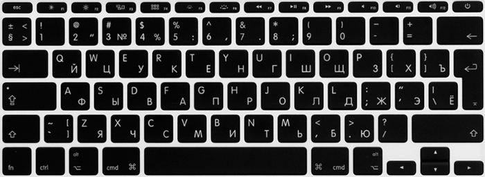

# Atom для фронтенда

Настройки, горячие кнопки, плагины и пр.

Я работаю на нескольких ОС: рабочий компьютер — Windows и Ubuntu, носимый — OSX. Расположение кнопок разное, запоминать разницу желания нет, горячие кнопки настраиваю так, чтобы с минимальными изменениями получить максимально похожее положение пальцев на любой ОС.

Синхронизация настроек, горячих кнопок и прочего — плагином [Sync Settings for Atom](http://atom.io/packages/sync-settings). [Гист с настройками](https://gist.github.com/nicothin/d9614ef7332cd069d3c5e0af088285db).

